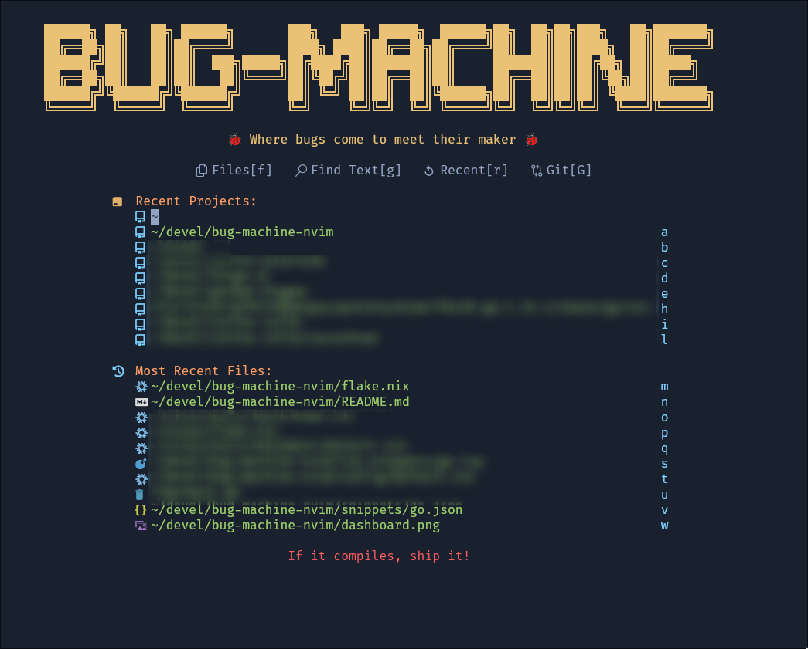

# :snowflake: Bug Machine Nvim

My personal Neovim flake, built with [nixvim](https://github.com/nix-community/nixvim).



## Quickstart

```sh
nix run github:lukasjarosch/bug-machine-nvim         # nixvim
nix run github:lukasjarosch/bug-machine-nvim#neovide # nixvim + neovide
```

## Layout

- `config/` — core options, keymaps, and the lua glue (`extraConfigLua`)
- `plugins/` — one file per plugin, auto-imported by `plugins/default.nix`
- `snippets/` — VS Code-format snippets (JSON)
- `lua-snippets/` — native luasnip snippets in Lua

## License

MIT. Personal config, no support.
