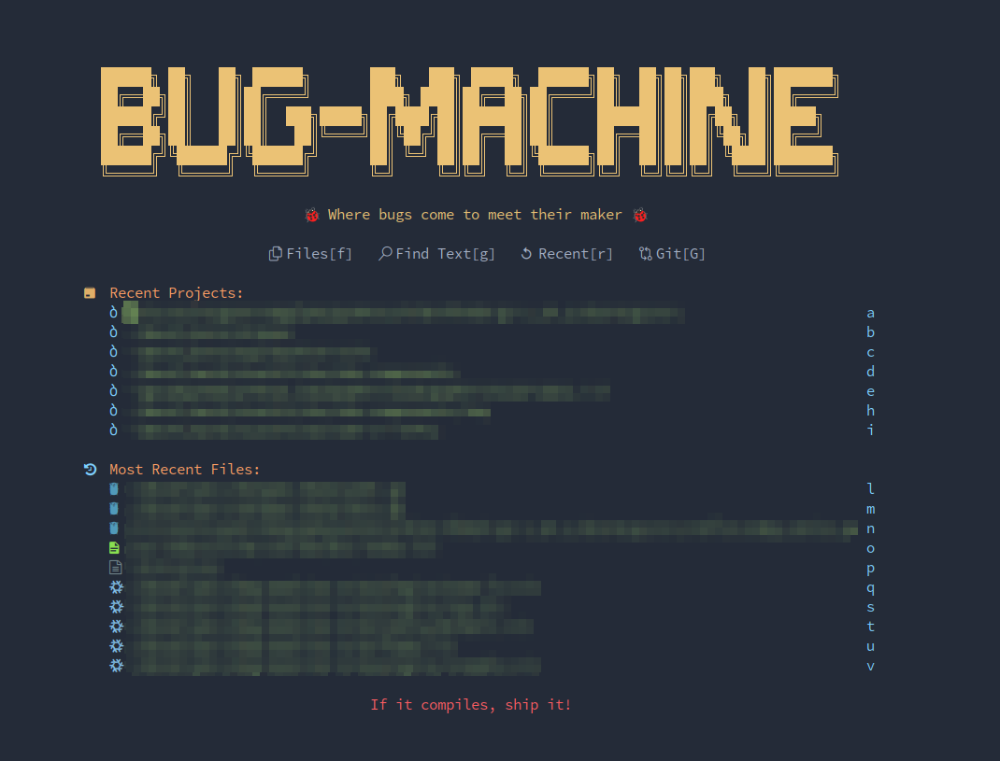

# :snowflake: Bug Machine Nvim
> Abandon all hope, clone at your own peril

## What is this abomination?

My personal Neovim flake built with Nixvim.
It's probably broken, definitely cursed, and somehow still works for me.
Use at your own risk - I take no responsibility for lost productivity, corrupted files, or existential crises that may result from using this config.

## License

MIT - Feel free to study this configuration as a cautionary tale of what not to do.
